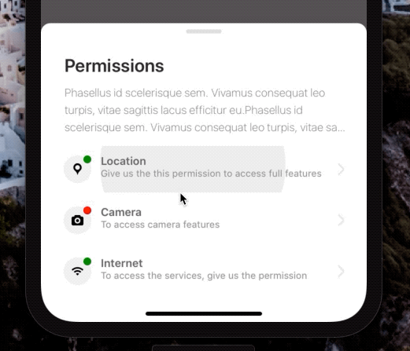
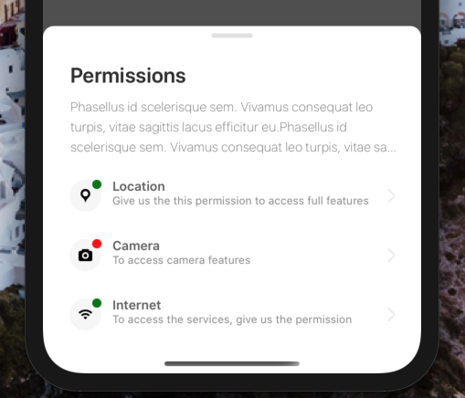

[](https://github.com/WrathChaos/react-native-permissions-modal)

[](https://github.com/WrathChaos/react-native-permissions-modal)

[](https://www.npmjs.com/package/react-native-permissions-modal)
[](https://www.npmjs.com/package/react-native-permissions-modal)

[](https://opensource.org/licenses/MIT)
[](https://github.com/prettier/prettier)

<p align="center">
  
  
</p>

# Installation

Add the dependency:

```ruby
npm i react-native-permissions-modal
```

## Peer Dependencies

###### IMPORTANT! You need install them

```js
"react": ">= 16.x.x",
"react-native": ">= 0.55.x",
"react-native-gesture-handler": ">= 1.6.0",
"react-native-material-ripple": ">= 0.9.1",
"react-native-modalize": ">= 1.3.7"
```

# Usage

## Import

```js
import {
  PermissionModal,
  PermissionItem
} from "react-native-permissions-modal";
```

## Usage

```js
<PermissionModal
  panGestureEnabled={false}
  closeOnOverlayTap={false}
  ref={ref => (this.permModal = ref)}
>
  <PermissionItem />
  <PermissionItem
    title="Camera"
    iconStatusColor="red"
    subtitle="To access camera features"
    source={require("./assets/photo.png")}
    onPress={() => alert("hello")}
  />
  <PermissionItem
    title="Internet"
    source={require("./assets/wifi.png")}
    subtitle="To access the services, give us the permission"
  />
</PermissionModal>
```

## Open Modal

```js
this.permModal.openModal();
```

## Close Modal

```js
this.permModal.closeModal();
```

# Configuration - Props

## PermissionModal

| Property   |   Type   |   Default   | Description                                             |
| ---------- | :------: | :---------: | ------------------------------------------------------- |
| title      |  string  | Permissions | change the title of the modal                           |
| subtitle   |  string  |   default   | change the subtitle of the modal                        |
| openModal  | function |   default   | to open the modal                                       |
| closeModal | function |   default   | to close the modal                                      |
| gradient   | boolean  |    false    | make the button with a gradient background and a shadow |
| width      |  number  |     150     | change the button's width                               |

## PermissionItem

| Property                     |   Type    |    Default    | Description                                          |
| ---------------------------- | :-------: | :-----------: | ---------------------------------------------------- |
| title                        |  string   |   Location    | change the title of the permission item              |
| subtitle                     |  string   |    default    | change the subtitle of the permission item           |
| source                       |   image   | default-image | change the image source of the permission item       |
| iconComponent                | component |    default    | set your own component instead of imaged icon        |
| ImageComponent               | component |     Image     | set your own component for Image such as `FastImage` |
| iconContainerBackgroundColor |   color   |    #f7f7f7    | change icon's background color                       |
| titleTextStyle               |   style   |    default    | change title's text style                            |
| subtitleTextStyle            |   style   |    default    | change subtitle's text style                         |

# FAQ

### Android: Modal does not response the touchables :O

Check out [`react-native-gesture-handler`'s documentation](https://kmagiera.github.io/react-native-gesture-handler/docs/getting-started.html) to set it up.

## Future Plans

- [x] ~~LICENSE~~
- [ ] Write an article about the lib on Medium

## Credits

Thank you for this awesome inspiration [João Angelo](https://dribbble.com/shots/9252130-iFood-Pending-Permissions/attachments/1296281?mode=media)

## Author

FreakyCoder, kurayogun@gmail.com

## License

React Native Permissions Modal is available under the MIT license. See the LICENSE file for more info.

Icons made by <a href="https://www.flaticon.com/authors/prosymbols" title="Prosymbols">Prosymbols</a> from <a href="https://www.flaticon.com/" title="Flaticon"> www.flaticon.com</a>
Icons made by <a href="https://www.flaticon.com/authors/google" title="Google">Google</a> from <a href="https://www.flaticon.com/" title="Flaticon"> www.flaticon.com</a>
